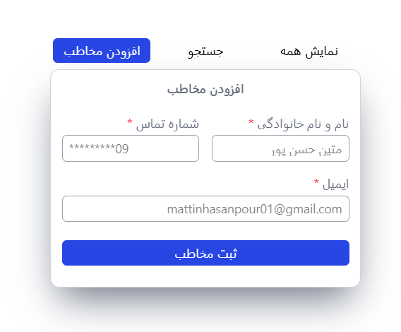

# Phone Number App 📱

This project is a simple **Phone Number** app built using **Vue.js**, **Tailwind CSS**, and **JavaScript**. It allows users to **add, search, and manage contacts**. The app is very simple and was built purely for fun, and is **not intended for any professional or commercial use**.

## Features ✨:

- Add, search, and display contacts.
- Simple and easy-to-use interface.
- Designed for entertainment and beginner learning.

## Follow Me 🌐:

- [Instagram](https://www.instagram.com/matinhasanpour_) 
- [Telegram](https://t.me/mattinhasanpour) 

---

This project is a beginner-level app built purely for fun and learning purposes. 🎉

**Note:**  
This project is **only for fun** and **not for commercial use**.

**Date:**  
- **Gregorian:** March 31, 2025  
- **Solar Hijri:** 11 Farvardin 1404
